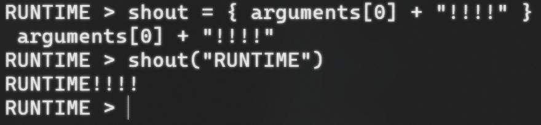
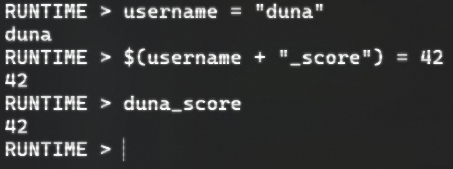
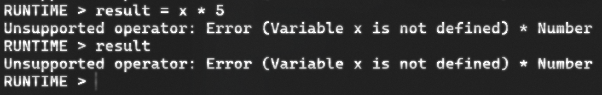

# SYNAPSE

**SYNAPSE is the new interpreter for [RUNTIME](https://github.com/Mikuel210/RUNTIME), a dynamic programming language
that removes the boundaries between data and code.**

## Navigation

- [Project Overview](#project-overview)
- [Current Features](#current-features)
- [Examples](#examples)
- [Getting Started](#getting-started)

## Project Overview

⛭ **RUNTIME is a complete reimagining of what a programming language could and should be.**

RUNTIME is a dynamic, interpreted language where code can think, adapt, and rewrite itself as it runs.
RUNTIME removes the boundaries between data and code, and empowers you with the tools you need to bring your raw, 
unfiltered creativity to life.

With RUNTIME, you can:

- [x] Declare and update variables and functions from dynamic names
- [x] Execute code on the fly and declare functions dynamically
- [x] Interact DIRECTLY with the interpreter
- [x] Modify and debug the RUNNING PROGRAM in real time

Whereas in other languages these features are hacks, in RUNTIME, they're expected. Let's unleash the power computers 
are ACTUALLY capable of...

- [x] Self debugging code
- [x] Self evolving neural networks
- [x] On demand AI written features
  
With RUNTIME, you can do that and much more.

⛭ **SYNAPSE is a complete rewrite of the RUNTIME interpreter**, built from the ground up in C# for greater power, stability 
and speed. SYNAPSE brings RUNTIME's philosophy to life by allowing for new possibilities, such as self-modifying 
and self-debugging software.

## Current Features

### Literals

- Numbers: `42`, `3.14`
- Text: `"Hello World!"`, `{ Hello World! }`
- Lists: `[]`, `[1, 2, 3]`

### Operators

- Arithmetic expressions: `+`, `-`, `*`, `/`, `^`, `%`
- Conditionals: `==`, `>`, `>=`, `<`, `<=`
- Logical expressions: `not`, `and`, `or`

### Variables

- Assignment: `$x = 1`
- Access: `$x` → 1

> Non-conflicting names can skip the `$` symbol: `x = 1`

#### Dynamic variable names

- `$("run" + "time") = 42`
- `runtime` → 42

### Functions

- Declaration: `function = { 1 + 1 }`
- Call: `function()` → 2

> Functions are just text variables, code is just data

#### Functions with arguments

- `ysws_money_from_hours = { arguments[0] * 5 }`
- `ysws_money_from_hours(5)` → 25

### Errors as values

- `! * 5` → `Unsupported operator: Error (Expected Number, Text, or OpenParenthesis, got Invalid) * Number`

> Errors are just values you can react to

## Examples

### Functions

### Dynamic variables

### Errors as values

## Getting started

1. Go to the [releases page](https://github.com/Mikuel210/SYNAPSE/releases/latest)
2. Download and unzip the release for your OS
3. Follow the instructions on README.md on the build directory

### Note on macOS

I don't have a Mac to sign or test SYNAPSE on. macOS might block unsigned applications or terminate processes automatically. If this happens, please follow the instructions below:

1. Make sure the [.NET SDK](https://dotnet.microsoft.com/en-us/download/dotnet/9.0) is installed
2. Clone the repository
3. On the `CLI` directory, run `dotnet run`

---

Made with ❤️ for Moonshot thanks to Hack Club

  

